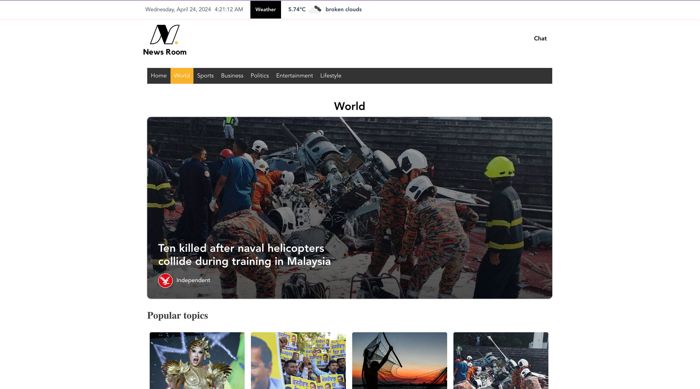
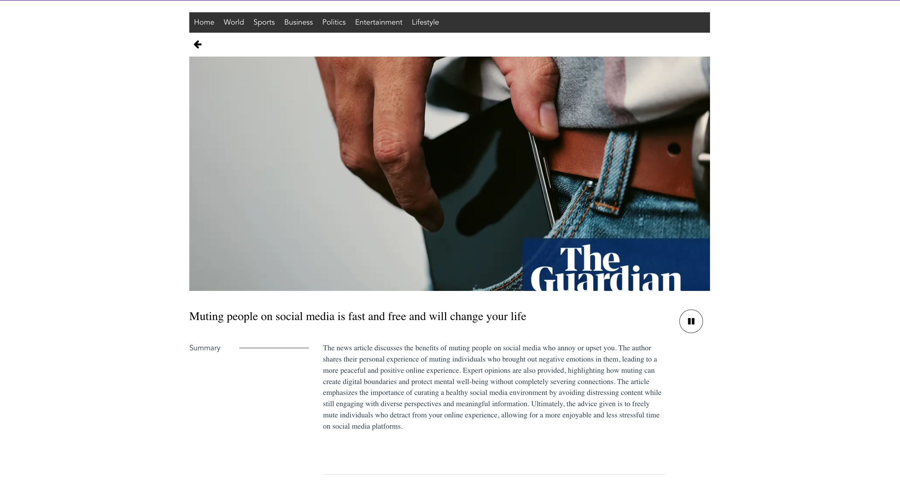
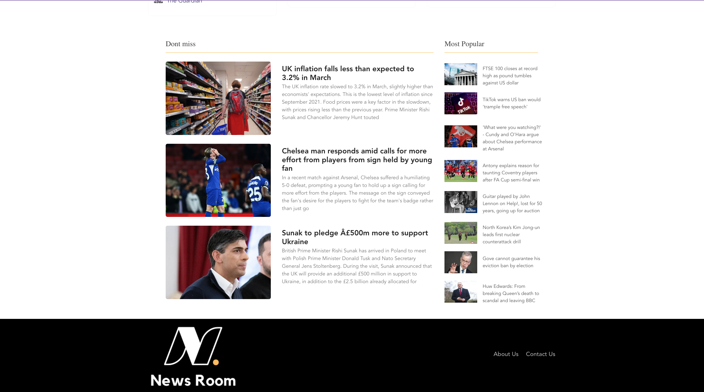

# News Room Web Application

A modern, feature-rich news aggregation platform built with Vue.js and AWS serverless architecture. This application provides real-time news updates from multiple sources, chat functionality, and advanced features like text-to-speech and news summarization.

## Project Aim

The aim of this project is to make it easy for everyone to stay update with the latest news,
without feeling overwhelmed by lots of information’s. The project also aims to explore the use
of Artificial intelligence in news aggregation and how it can further help users stay informed.
The project will be focused on building a web application that helps individuals to easily
access news articles. The application will also support some amazing functionality like
summarization of article, text to spoken words and a chat room for communication between
multiple users. The web application can be accessed on the web browser and as a web
application and android based application with the help of PWA (Progressive web apps)

## Application Preview


### Key Interface Features

- **Dynamic Weather Display**: Real-time weather information (Temperature and conditions)
- **Category Navigation**: Easy access to World, Sports, Business, Politics, Entertainment, and Lifestyle sections
- **News Cards**: Clean, responsive layout showing news from multiple sources
- **Article Summaries**: AI-powered article summarization for quick reading
- **Chat Integration**: Real-time discussion capabilities
- **Multi-source Integration**: News from BBC, Guardian, Independent, and TalkSport

### Application Screenshots

#### Homepage and Navigation


_Navigation bar with weather integration and category selection_

#### News Article View


_Detailed article view with summarization and text-to-speech options_

#### Latest News Section


_Dynamic latest news feed with multi-source integration_

## Features

- **Multi-Source News Aggregation**

  - BBC News
  - The Guardian
  - The Independent
  - TalkSport
  - Categorized news sections (Business, Entertainment, Politics, Sports, World, Lifestyle)

- **Real-Time Chat System**

  - Group chat functionality
  - WebSocket-based communication
  - Real-time message updates
  - Chat room management

- **Advanced Features**

  - News article summarization
  - Text-to-speech functionality
  - Offline support with Service Workers
  - Responsive design for all devices
  - Custom pagination

- **User Experience**
  - Dark/Light mode support
  - Loading states and animations
  - Navigation bar with category filters
  - Single page article view

## Tech Stack

### Frontend

- Vue.js 3
- Vuex for state management
- Vue Router for navigation
- Axios for HTTP requests
- Progressive Web App (PWA) support

### Backend (AWS Serverless)

- AWS Lambda Functions
- WebSocket API for real-time chat
- DynamoDB for data storage
- Python for news scraping
- Node.js for API handlers

## Project Structure

```
├── src/                   # Frontend source code
│   ├── assets/           # Images and static assets
│   ├── components/       # Vue components
│   ├── views/            # Page components
│   ├── store/            # Vuex store
│   ├── App.vue          # Root component
│   └── main.js          # Application entry point
│
├── Aws-Files/            # Backend serverless functions
│   ├── chatApplication/  # Chat functionality
│   ├── newsScrapper/    # News aggregation scripts
│   ├── newsSummarizer/  # Article summarization
│   ├── sendingDataWebsocket/  # WebSocket handlers
│   └── textToSpeech/    # Text-to-speech service
│
├── public/              # Static files
│   ├── service-worker.js # PWA service worker
│   └── images/          # Public images
│
└── tests/              # Unit tests
```

## Getting Started

1. **Prerequisites**

   - Node.js (v14 or higher)
   - npm or yarn
   - AWS account (for backend deployment)

2. **Installation**

   ```bash
   # Clone the repository
   git clone [repository-url]

   # Navigate to the project directory
   cd news-app

   # Install dependencies
   npm install

   # Serve with hot reload at localhost:8080
   npm run serve
   ```

3. **Build for Production**

   ```bash
   npm run build
   ```

4. **Run Tests**
   ```bash
   npm run test:unit
   ```

## Technical Documentation

### Architecture Overview

The News Room application follows a modern serverless architecture leveraging AWS services for backend operations and Vue.js for the frontend interface.

#### Frontend Architecture

```
Vue.js Frontend
├── Components
│   ├── Navigation (NavBar, MenuTop)
│   ├── News Display (ArticleView, NewsCard)
│   ├── Chat Interface
│   └── Weather Widget
├── State Management (Vuex)
└── Router (Vue Router)
```

#### Backend Architecture (AWS Serverless)

```
AWS Services
├── Lambda Functions
│   ├── News Scraping (Python)
│   ├── Article Summarization
│   ├── Text-to-Speech
│   └── WebSocket Handlers
├── API Gateway
│   ├── REST API
│   └── WebSocket API
└── DynamoDB Tables
    ├── News Articles
    ├── User Data
    └── Chat Messages
```

### AWS Backend Setup

The application requires several AWS services to be configured:

1. Deploy Lambda functions in the `Aws-Files` directory
2. Configure WebSocket API Gateway
3. Set up DynamoDB tables for chat and user data
4. Configure necessary IAM roles and permissions

#### Service Configuration Details

1. **News Scraping Service**

   - Language: Python
   - Sources: BBC, Guardian, Independent, TalkSport
   - Scheduling: CloudWatch Events trigger

2. **Chat Service**

   - WebSocket API Gateway integration
   - DynamoDB for message persistence
   - Lambda functions for connection management

3. **Article Processing**
   - Summarization service
   - Text-to-speech conversion
   - Content categorization

Detailed AWS setup instructions can be found in the respective service directories.

## Contributing

1. Fork the repository
2. Create your feature branch (`git checkout -b feature/AmazingFeature`)
3. Commit your changes (`git commit -m 'Add some AmazingFeature'`)
4. Push to the branch (`git push origin feature/AmazingFeature`)
5. Open a Pull Request

## License

This project is licensed under the MIT License - see the LICENSE file for details.

## Acknowledgments

- News data provided by BBC, The Guardian, The Independent, and TalkSport
- AWS for serverless infrastructure
- Vue.js team for the excellent framework
